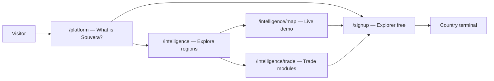

# Traction Pages — Consolidated Fortune-5 Stress Test

**Pages under review:**
- `/platform` — product landing ([`PlatformHub.tsx`](../../apps/api-gateway/src/app/platform/PlatformHub.tsx))
- `/intelligence` — content/regional hub ([`IntelligenceHub.tsx`](../../apps/api-gateway/src/app/intelligence/IntelligenceHub.tsx))

**Benchmark set:** Bloomberg Terminal, LSEG Refinitiv Workspace, S&P Global Market Intelligence, Moody's Analytics  
**Audit date:** 2026-06-28  
**Implementation date:** 2026-07-01  
**Prior site-wide score:** 4.2 / 10 ([`souvera-fortune5-readiness-audit.md`](./souvera-fortune5-readiness-audit.md))

**Related docs:**
- [`docs/ux/phase-2.5-certification.md`](../ux/phase-2.5-certification.md) — manual smoke checklist
- [`docs/execution/MASTER-EXECUTION-PLAN.md`](../execution/MASTER-EXECUTION-PLAN.md) — Tier 2.5 sign-off

---

## Executive verdict — portfolio view

| Metric | `/platform` | `/intelligence` | Combined |
|--------|-------------|-----------------|----------|
| **Overall score (pre-implementation)** | **7.4 / 10** | **7.2 / 10** | **7.3 / 10** |
| **Page role** | Product acquisition | Regional exploration | Complementary funnel |
| **Executive demo safe** | Yes (caveats) | Yes | Yes for hub tour |
| **Explorer conversion ready (pre)** | **Yes** | **No** — critical gap | Partial |
| **Institutional buyer ready** | Partial | Partial | Partial |
| **Fortune-5 parity** | ~74% | ~72% | ~73% |

### Strategic read

These two pages form a **two-step funnel**, but they were not aligned before this implementation:



**What works well:**
- `/platform` is a credible **product landing page** — stack narrative, tier strip, signup-first CTAs
- `/intelligence` is Souvera's **strongest regional storytelling page** — Africa/Caribbean command cards are Fortune-5 quality content architecture
- Both share trust methodology language aligned with Phase 2.5 certification
- Live map preview on both pages gives immediate product proof without auth

**Critical misalignment (resolved in TRACT-F5 P0/P1):**
- `/platform` pushed **Create free account**; `/intelligence` ended on **Request Access** only — SEO traffic landing on intelligence never saw Explorer signup
- Both pages duplicated `IntelligenceMapPreview` with identical copy
- Phase 2.5 crown jewels (AfCETA corridors, SDM, AGOA flows) were under-surfaced on `/intelligence`

**Recommendation:** Treat `/platform` + `/intelligence` as a **single traction system** with shared components and unified conversion logic.

---

## Scoring rubric (9 dimensions)

| # | Dimension | Weight | `/platform` | `/intelligence` | Benchmark |
|---|-----------|--------|-------------|-----------------|-----------|
| 1 | Value proposition | 15% | **7.5** | **8.5** | 9.0 |
| 2 | Product proof | 15% | **6.5** | **7.0** | 9.0 |
| 3 | Trust & credibility | 15% | **7.0** | **6.5** | 9.5 |
| 4 | Conversion funnel | 15% | **8.0** | **6.0** | 8.5 |
| 5 | Information architecture | 10% | **8.5** | **8.5** | 9.0 |
| 6 | Visual design & UX | 10% | **8.0** | **8.0** | 9.0 |
| 7 | Content substantiation | 10% | **7.5** | **7.0** | 9.5 |
| 8 | SEO & technical | 5% | **6.5** | **7.5** | 9.0 |
| 9 | A11y & performance | 5% | **6.0** | **6.0** | 9.0 |

**Weighted totals (pre-implementation):**
- `/platform`: **7.4 / 10**
- `/intelligence`: **7.2 / 10**

---

## TRACT-F5 backlog

Backlog IDs use prefix **TRACT-F5-** (traction pages, Fortune-5).

### P0 — Fix before Phase 2.5 sign-off

| ID | Task | Page(s) | Status |
|----|------|---------|--------|
| TRACT-F5-01 | Add **Create free Explorer account** to intelligence hero | Intelligence | ✅ Implemented |
| TRACT-F5-02 | Replace `AccessCTABlock` with signup-first footer (`TractionConversionCta`) | Intelligence | ✅ Implemented |
| TRACT-F5-03 | Fix **6 → 8 sectors** in hero stats + intelligence OG description | Both | ✅ Implemented |
| TRACT-F5-04 | Extract **`AuditProofCallout`** shared component | Both | ✅ Implemented |
| TRACT-F5-05 | Extract **`ComplianceMicroRow`** (privacy · terms · data sources) | Both | ✅ Removed — footer links sufficient; data-sources in TrustSourceLayer |
| TRACT-F5-06 | Cross-links: intelligence → `/platform`; platform → `/intelligence` | Both | ✅ Implemented |

### P1 — Conversion and content lift

| ID | Task | Page(s) | Status |
|----|------|---------|--------|
| TRACT-F5-07 | **Trade Intelligence spotlight** — AfCETA, SDM, AGOA flows | Intelligence | ✅ Implemented |
| TRACT-F5-08 | Add **TrustStrip** to intelligence page | Intelligence | ✅ Implemented |
| TRACT-F5-09 | Shared **sticky conversion bar** (signup + open map) | Both | ✅ Implemented |
| TRACT-F5-10 | **Differentiate map preview** copy — platform vs regional | Both | ✅ Implemented |
| TRACT-F5-11 | Terminal **screenshot strip** (Map · Trade · SDM) | Platform | 📋 Backlog |
| TRACT-F5-12 | JSON-LD `SoftwareApplication` + branded OG images | Both | ✅ Implemented |
| TRACT-F5-13 | Compact **tier strip** on intelligence footer | Intelligence | ✅ Implemented |

### P2 — Fortune-5 parity (when resources allow)

| ID | Task | Page(s) | Status |
|----|------|---------|--------|
| TRACT-F5-14 | 90-second product walkthrough video | Platform | 📋 Backlog |
| TRACT-F5-15 | Institutional client logo wall | Both | 📋 Backlog |
| TRACT-F5-16 | Lighthouse audit + mobile QA (target 90+) | Both | 📋 Backlog |
| TRACT-F5-17 | Case study module | Both | 📋 Backlog |
| TRACT-F5-18 | GDP $3.4T source footnote on intelligence stats | Intelligence | 📋 Backlog |

---

## Shared component architecture

```
components/marketing/
  PublicPageHero.tsx              — shared sub-page hero (legal + resources + platform)
components/marketing/traction/
  AuditProofCallout.tsx           — governed coverage stats (public-facing)
  StickyConversionBar.tsx         — signup + map on scroll
  TradeIntelligenceSpotlight.tsx  — AfCETA / SDM / AGOA featured strip
  TractionConversionCta.tsx       — signup-first footer
  TractionJsonLd.tsx              — SoftwareApplication schema + OG helper
```

Reused from existing marketing:
- `PlatformAccessTierStrip.tsx` — tier comparison on both pages
- `TrustStrip` — platform had it; now on intelligence too

---

## Funnel role definition

| Visitor intent | Entry page | Desired next step |
|----------------|------------|-------------------|
| "What is Souvera?" | `/platform` | Signup or open map |
| "Tell me about Africa/Caribbean" | `/intelligence` | Regional hub → map → signup |
| "Show me trade data" | `/intelligence/trade` or spotlight | SDM/AGOA/AfCETA → signup |
| "I'm ready to buy enterprise" | Either | Request access / contact sales |

Both pages now offer the same three exit actions:
1. Create free account (`/signup`)
2. Open intelligence map (`/intelligence/map`)
3. Request institutional access (`/access/request-access`)

---

## Side-by-side comparison (post-implementation)

| Criterion | `/platform` | `/intelligence` |
|-----------|-------------|-----------------|
| Hero CTAs | Signup + map + plans | Africa + Caribbean + signup + platform |
| Regional depth | Cross-link only | Africa + Caribbean cards |
| Trade intelligence | Cross-link + modules | Spotlight strip + tool cards |
| Trust layers | Methodology + strip + source + audit proof | Same stack |
| Tier clarity | Full strip | Full strip (shared component) |
| Signup conversion | Yes | Yes |
| Cross-link to sibling | Yes → intelligence | Yes → platform |
| JSON-LD + OG | Yes | Yes |
| Sticky CTA | Yes | Yes |

---

## Remaining Fortune-5 gaps (both pages)

| Gap | Bloomberg / S&P pattern | Status |
|-----|---------------------------|--------|
| Client / institution logos | "Trusted by X" | Data source logos only |
| Product video | 60–90s walkthrough | None (TRACT-F5-14) |
| Terminal screenshots on platform | Product beyond map widget | Backlog (TRACT-F5-11) |
| Case study / testimonial | Named institutional user | None (TRACT-F5-17) |
| Lighthouse 90+ documented | Performance SLA | Unknown (TRACT-F5-16) |
| GDP source footnote | Quantified stats with citation | Backlog (TRACT-F5-18) |

---

## Manual smoke checklist (traction pages)

| # | Action | Expected |
|---|--------|----------|
| 1 | Open `/platform` — hero | 8 sectors stat; signup + map + plans CTAs |
| 2 | Open `/intelligence` — hero | 8 sectors stat; signup + "About the platform" CTAs |
| 3 | Scroll both pages | Sticky bar appears after ~480px scroll |
| 4 | Intelligence footer | Explorer signup CTA (not request-access-only) |
| 5 | Trade spotlight | Links to AfCETA, SDM, AGOA flows |
| 6 | View page source | `SoftwareApplication` JSON-LD present |
| 7 | Audit proof callout | 592 / 416 / 74-74 stats; headline "Governed trade intelligence coverage" (no Phase 2.5 label) |

---

## Public pages enhancement (July 2026)

| Page | Status |
|------|--------|
| `/legal/privacy`, `/legal/terms` | Rewritten with metadata, Legal hero, structured sections |
| `/legal/cookies`, `/legal/accessibility` | Migrated to new ComplianceLayout |
| `/resources/data-sources` | PublicPageHero; Census + GDELT; tier legend; registry note |
| `/insights/methodology` | PublicPageHero; trade methodology; platform cross-links |
| `/platform/signal-engine`, `/platform/data-foundation` | PublicPageHero; signup-first CTAs |
| Trust cleanup | Single Live & Curated in TrustSourceLayer; ComplianceMicroRow removed |
| Shared component | `PublicPageHero.tsx` for sub-page hero consistency |
