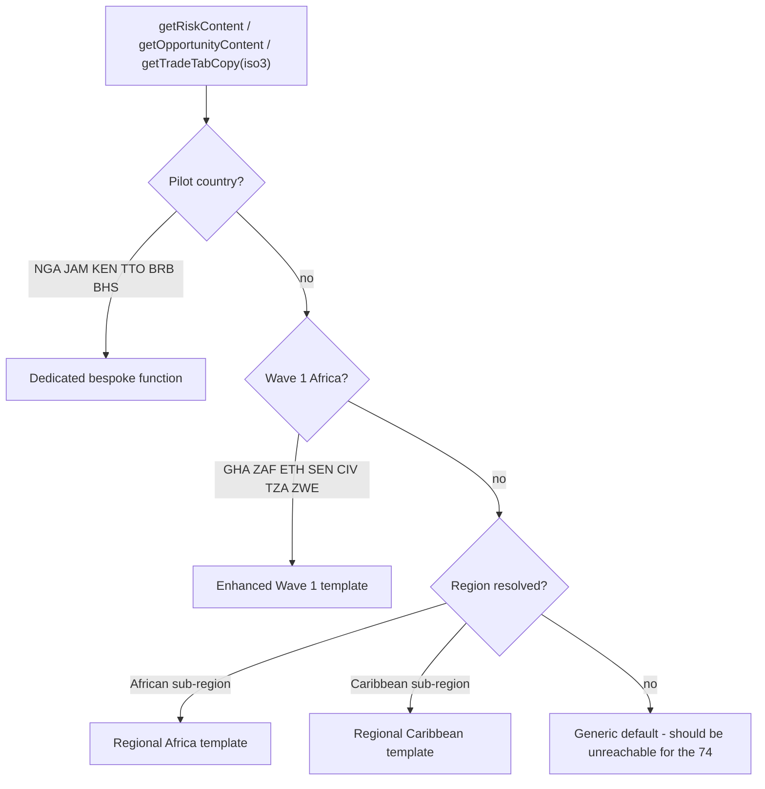
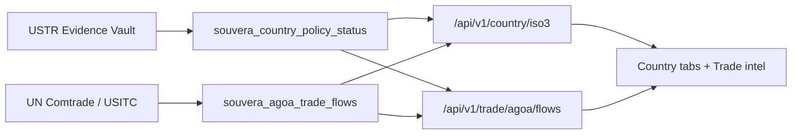

# Regional Content Architecture — 74-Market Production Readiness

**Owner:** Afronovation, Inc.
**Status:** Implemented
**Purpose:** Guarantee that every one of the 74 approved markets renders production-quality intelligence (Risk, Opportunity, Trade, Sectors, Economy FX, News Pulse) so stakeholders never hit missing data or generic placeholder content.

---

## Problem this solves

Before this work, only ~13 markets (6 pilots + 7 Wave 1) had quality content. The remaining ~61 markets fell back to thin generic defaults:

- Risk tab: 3 generic items ("Monitor exchange rate trends in the Economy tab")
- Opportunity tab: placeholder pillars ("See Sectors tab")
- Trade tab: WTO-only (no SADC/COMESA/ECOWAS/EAC/CARICOM)
- Sectors tab: empty ("Sector intelligence is being prepared")
- Economy FX: "data pending"
- Overview News Pulse: perpetual "Pending review"

## Content tiers (after)



| Tier | Markets | Source |
|------|---------|--------|
| Dedicated | NGA, JAM, KEN, TTO, BRB, BHS | bespoke functions in `country-risk-content.ts` / `country-opportunity-content.ts` |
| Enhanced Wave 1 | GHA, ZAF, ETH, SEN, CIV, TZA, ZWE | `wave1AfricaRisk` / `wave1AfricaOpportunity` (now 8/3-pillar depth) |
| Regional | all remaining African + Caribbean markets | `country-regional-content.ts` |

## Region classification

`apps/api-gateway/src/lib/intelligence/country-regions.ts` maps all 54 African ISO3 codes to AU sub-regions and Caribbean ISO3 codes to currency/bloc sub-groups.

| African sub-region | Bloc focus | Trade template |
|--------------------|-----------|----------------|
| `north` | AfCFTA, GAFTA, EU association | `NORTH_AFRICA_TRADE` |
| `west` | ECOWAS, AGOA, AfCFTA | `AFRICA_TRADE` (ECOWAS) |
| `east` | EAC, COMESA, AfCFTA, AGOA | `EAST_AFRICA_TRADE` |
| `central` | CEMAC, ECCAS, AfCFTA | `CENTRAL_AFRICA_TRADE` |
| `southern` | SADC, COMESA, AfCFTA, AGOA | `SOUTHERN_AFRICA_TRADE` |

| Caribbean sub-region | Members | Trade template |
|----------------------|---------|----------------|
| `oecs` | XCD users (ATG, DMA, GRD, KNA, LCA, VCT) | `CARIBBEAN_TRADE` |
| `cariforum` | sovereign CARIFORUM states (DOM, HTI, GUY, SUR, BLZ, ...) | `CARIBBEAN_TRADE` |
| `territory` | PRI, VGB, TCA, CYM | `CARIBBEAN_TERRITORY_TRADE` |

## Content files

| File | Responsibility |
|------|----------------|
| `country-regions.ts` | Sub-region classification + bloc membership sets |
| `country-regional-content.ts` | `regionalRiskContent()` and `regionalOpportunityContent()` generators |
| `country-risk-content.ts` | Pilot + Wave 1 risk; routes the rest to regional |
| `country-opportunity-content.ts` | Pilot + Wave 1 opportunity; routes the rest to regional |
| `country-trade-content.ts` | Pilot KEN + regional trade templates; routes by sub-region |

Regional risk produces 8 items (3 macro / 2 political / 3 operational) with `{{FX}}`, `{{INFLATION}}`, `{{MACRO_ASOF_YEAR}}` tokens hydrated by the panel. Regional opportunity produces 3 sector pillars + entry points + quantified regional advantages.

## Data layer (seed scripts)

All scripts live in `apps/api-gateway/scripts/` and are idempotent (skip already-populated markets):

| Script | Effect |
|--------|--------|
| `seed-all74-fx.ts` | Curated 2024 reference `fx_to_usd` for markets missing it (62 seeded) |
| `seed-all74-sectors.ts` | 7-sector Bloomberg-grade baseline for markets with zero sectors (60 markets / 420 rows) |
| `enhance-incomplete-sectors.ts` | Backfills emoji, scores, structured `key_players` on curated-but-incomplete rows |
| `seed-all74-news-pulse.ts` | Neutral baseline News Pulse for markets without a published signal (65 seeded) |
| `audit-74-production-readiness.ts` | Audits FX / sector / news coverage |
| `test-all74-content.ts` | Asserts every market has substantive risk/opportunity/trade content (CI-style gate) |
| `test-all74-data-consistency.ts` | Cross-surface gate: vault ↔ flows ↔ macro hero logic (CI) |
| `reconcile-agoa-eligibility.ts` | Syncs Evidence Vault AGOA status → `souvera_agoa_trade_flows.agoa_eligible` |

## Data lineage (trade + AGOA consistency)



**Single AGOA eligibility authority:** `souvera_country_policy_status` (Evidence Vault). Run `reconcile-agoa-eligibility.ts` after vault updates to sync trade-flow flags.

**Trade volumes:** `souvera_agoa_trade_flows` is the canonical store. Live Comtrade ingest (`services/ingestion/ingest-comtrade-agoa.ts`) updates tier-A rows when `COMTRADE_API_KEY` is set.


1. **Promote to dedicated tier:** add a bespoke function and route it first in the relevant `get*Content` switch.
2. **Adjust regional defaults:** edit the sub-region profile in `country-regional-content.ts` (risk) or the `AFRICA_OPP_PROFILES` / `CARIBBEAN_OPP_PROFILES` maps (opportunity).
3. **Fix region mapping:** update `AFRICA_SUBREGION` or the Caribbean sets in `country-regions.ts`.
4. **Upgrade sectors with real data:** model `scripts/seed-kenya-sectors.ts` and upsert on `country_id,sector_key` (baseline rows are overwritten by curated rows with the same key).
5. **Upgrade News Pulse:** add the market to the GDELT pilot (`scripts/lib/news-pulse-pilot.ts`) and run `scripts/ingest-news-pulse.ts`.

## Verification

```bash
# Data coverage
npx tsx apps/api-gateway/scripts/audit-74-production-readiness.ts
# Content readiness (exits non-zero on any gap)
npx tsx apps/api-gateway/scripts/test-all74-content.ts
# Cross-surface data consistency (vault ↔ flows ↔ macro)
npx tsx apps/api-gateway/scripts/test-all74-data-consistency.ts
# Top-20 macro coverage
npm --prefix apps/api-gateway run check:all74-top20
```

Expected: FX 74/74, news 74/74, sectors complete, content readiness all-pass. Top-20 macro is 68/74 with 6 documented structural-ceiling markets (ERI, SSD, CUB, PRI, VGB, TCA).
