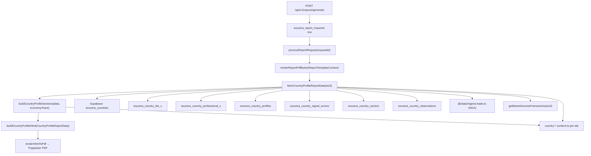

# Country Profile Report — Data Schema Inspection

**Generated:** 2026-06-02  
**Scope:** Country Profile PDF only (`reportType === "Country Profile"`)  
**Sample country:** Nigeria (`NGA`)

---

## Data flow (where the report pulls data)



| Step | File | Role |
|------|------|------|
| API | `apps/api-gateway/src/app/api/v1/reports/generate/route.ts` | Auth, quota, insert `souvera_report_requests`, call `processReportRequest` |
| Processor | `apps/api-gateway/src/lib/reports/process-report-request.ts` | Load profile MD overrides; call `renderReportPdfBytes` |
| Assembler | `apps/api-gateway/src/lib/reports/country-profile-data.ts` | **`fetchCountryProfileReportData`** — merges DB + static trade + signal |
| Section builder | `apps/api-gateway/src/lib/reports/country-profile-sections.ts` | **`buildCountryProfileSections`** — terminal tab copy + parsers |
| Template | `apps/api-gateway/src/lib/reports/templates/country-profile-html.ts` | **`buildCountryProfileHtml`** — HTML → PDF |
| Renderer | `apps/api-gateway/src/lib/reports/render-report.ts` | Puppeteer path for Country Profile |
| Renderer | `apps/api-gateway/src/lib/reports/render-pdf-puppeteer.ts` | `page.pdf()` |

**Terminal API (related, not identical payload):** `GET /api/v1/country/[iso3]` returns `CountryIntelligenceResponse` — richer than the report payload (news pulse, momentum, full trade object, time series API shape).

**Dump script (repro sample):**

```bash
cd apps/api-gateway
npx tsx scripts/dump-country-profile-payload.ts NGA
# → scripts/country-profile-nga-payload-sample.json
```

---

## Current Data Schema

### 1. Report payload (passed into template)

**Primary interface:** `CountryProfileReportData`  
**File:** `apps/api-gateway/src/lib/reports/country-profile-data.ts`

```typescript
interface CountryProfileReportData {
  country: {
    name: string;
    iso3: string;
    iso2?: string;
    region?: string;
    capital?: string;
    currencyCode?: string;
  };
  generatedAt: string;           // locale date string at fetch time
  freshnessAt?: string;          // ISO from profile or lite view
  summary?: string;              // summary_md OR fallback generator
  whyNow?: string;               // why_now_md — fetched but NOT used in PDF today
  riskNarrative?: string;        // risk_narrative_md — optional; parser if present
  opportunityThesis?: string;    // opportunity_thesis_md — optional; parser if present
  metrics: Array<{ label: string; value: string }>;  // formatted display strings
  signalScan: { badge: string; bullets: [string, string] };
  sectors: Array<{
    label: string;
    strength?: number;
    growth?: number;
    attractiveness?: number;
    teaser?: string;
  }>;
  marketAccess: Array<{
    label: string;
    statusLabel: string;
    description: string;
  }>;
  tradeSummary?: {
    exportsUsd?: string;
    importsUsd?: string;
    topPartners: Array<{ country: string; sharePct?: number }>;
  };
  sources: string;               // static string today
  sections: CountryProfileSections;  // built in same fetch — see below
  economyYears: EconomyYearPoint[];
}
```

### 2. Section assembly (`sections` tree)

**File:** `apps/api-gateway/src/lib/reports/country-profile-sections.ts`

```typescript
interface CountryProfileSections {
  glossary: ReportGlossary;  // static CORE_TERMS + country intro
  souvera: ReportSectionBlock & { capabilities: string[] };
  geography: ReportSectionBlock & { facts: ReportFact[] };
  introduction: ReportSectionBlock & { headline: string };
  political: ReportSectionBlock & {
    items: Array<{ title; severity; body; mitigants? }>;
  };
  economic: ReportSectionBlock & { indicatorBullets: string[] };
  tradeAndSectors: ReportSectionBlock & {
    regionalFrameworkIntro: string;
    sectorScorecardIntro: string;
    marketAccessIntro: string;
    tradeFinanceIntro: string;
    tradeFinanceBullets: string[];
    regionalAgreements: Array<{ name: string; description: string }>;
  };
  opportunity: {
    intro: string;
    paragraphs: string[];
    lead: string;
    entryPointsIntro: string;
    pillars: ParsedPillar[];
    entryPoints: Array<{ title: string; body: string }>;
    regionalAdvantagesIntro: string;
    regionalAdvantages: Array<{ title: string; body: string }>;
  };
  risk: {
    intro: string;
    paragraphs: string[];
    lead: string;
    categories: ParsedRiskCategory[];
    mitigationIntro: string;
    mitigationStrategies: Array<{ title: string; body: string }>;
    closingSummary: string;
  };
  signalAndDifferentiation: ReportSectionBlock & {
    badge: string;
    signalBullets: [string, string];
    differentiators: string[];
  };
}
```

**Parsers (markdown → structured):** `apps/api-gateway/src/lib/reports/report-narrative-parser.ts`

- `ParsedPillar`, `ParsedOpportunity`, `ParsedRiskCategory`, `ParsedRiskItem`, `ParsedRisk`

### 3. PDF render context (API → processor)

**File:** `apps/api-gateway/src/lib/reports/templates.ts`

```typescript
interface ReportTemplateContext {
  countryName: string;
  iso3: string;
  reportType: string;
  generatedAt: string;
  summary?: string;
  opportunityThesis?: string;
  riskNarrative?: string;
  query?: string;
}
```

`render-report.ts` may re-call `buildCountryProfileSections` when any of `summary | opportunityThesis | riskNarrative` overrides are passed from the request row.

### 4. Terminal / country API types (not 1:1 with report)

**File:** `apps/api-gateway/src/types/country-intelligence.ts`

| Type | Purpose |
|------|---------|
| `CountryIdentity` | iso3, name, region, capital, currency |
| `CountryMetrics` | Raw numeric macro fields |
| `CountrySignal` | level, investmentScore, scan |
| `CountrySector` | sectorKey, scores, narratives, AGOA fields |
| `CountryNarrative` | summary, whyNow, opportunityThesis, riskNarrative |
| `CountryTrade` | Full trade object (partners, composition, intra-African, agoa) |
| `TimeSeriesYear` / `CountryTimeSeries` | Economy tab series + forecast |
| `CountryIntelligenceResponse` | Full terminal bundle |

### 5. Economy time series (report)

**File:** `apps/api-gateway/src/lib/intelligence/country-economy-content.ts`

```typescript
interface EconomyYearPoint {
  year: number;
  gdp_current_usd?: number;
  gdp_growth_pct?: number;
  fdi_net_inflows_usd?: number;
  inflation_cpi_pct?: number;
  fx_to_usd?: number;
}
```

Built from `souvera_country_observations` where `souvera_indicators.key` ∈  
`gdp_current_usd | gdp_growth_pct | fdi_net_inflows_usd | inflation_cpi_pct | fx_to_usd`.

### 6. Trade (static TS modules per country)

**File:** `apps/api-gateway/src/types/country-intelligence.ts` → `CountryTrade`

**Nigeria source:** `apps/api-gateway/src/data/nigeria-trade.ts` (`NIGERIA_TRADE`)

Report only maps: `exportsUsd`, `importsUsd`, `topPartners[0..2]` → `tradeSummary`.  
**Not passed to PDF:** `exportComposition`, `importComposition`, `intraAfrican`, `agoa`, `exportsToUs`, etc.

### 7. Market access / policy status

**File:** `apps/api-gateway/src/lib/intelligence/market-access-registry.ts`

```typescript
type MarketAccessStatus = 'active' | 'suspended' | 'graduated' | 'ineligible' | 'not_applicable' | 'info';

interface MarketAccessFramework {
  id: string;
  label: string;
  emoji?: string;
  description: string;
  status: MarketAccessStatus;
  statusLabel?: string;
}
```

For NGA: AGOA (from `agoa-full-coverage`), AfCFTA, ECOWAS — computed in code, not a DB table.

### 8. Tab copy libs (static per iso3, merged into `sections`)

| Tab | Getter | File |
|-----|--------|------|
| Overview | `getOverviewContent(iso3, name, metricsRaw)` | `country-overview-content.ts` |
| Economy | `getEconomyTabCopy(iso3)` | `country-economy-content.ts` |
| Opportunity | `getOpportunityContent(iso3, name)` | `country-opportunity-content.ts` |
| Risk | `getRiskContent(iso3, name)` | `country-risk-content.ts` |
| Trade | `getTradeTabCopy(iso3)` | `country-trade-content.ts` |

**Risk tab types** (`country-risk-content.ts`): `RiskItem`, `RiskCategoryContent`, `MitigationStrategy`, `CountryRiskContent`.

**Opportunity tab types** (`country-opportunity-content.ts`): `OpportunityPillar`, `OpportunityEntryPoint`, `RegionalAdvantage`, `CountryOpportunityContent`.

### 9. Supabase tables (report fetch)

| Table / view | Fields used |
|--------------|-------------|
| `souvera_countries` | id, iso2, iso3, name, region, capital, currency_code |
| `souvera_country_lite_v` | gdp_current_usd, gdp_growth_pct, population_total, freshness_at |
| `souvera_country_professional_v` | fdi_net_inflows_usd, inflation_cpi_pct, fx_to_usd |
| `souvera_country_profiles` | summary_md, why_now_md, risk_narrative_md, opportunity_thesis_md, freshness_at |
| `souvera_country_signal_scores` | signal_level, investment_score |
| `souvera_country_sectors` | sector_label, strength_score, growth_score, attractiveness_score, teaser |
| `souvera_country_observations` | annual 2020–2025, joined `souvera_indicators.key` |

---

## Nigeria Example Payload

**Source:** Live fetch via `fetchCountryProfileReportData('NGA')` on 2026-06-02.  
**Full sample (MD fields truncated to 800 chars in nested strings):**  
`apps/api-gateway/scripts/country-profile-nga-payload-sample.json`

### Top-level (as passed to `buildCountryProfileHtml`)

```json
{
  "country": {
    "name": "Nigeria",
    "iso3": "NGA",
    "iso2": "NG",
    "region": "Africa",
    "capital": "Abuja",
    "currencyCode": "NGN"
  },
  "generatedAt": "June 2, 2026",
  "freshnessAt": "2026-05-26T19:20:29.1+00:00",
  "summary": "Nigeria is profiled in Souvera's institutional intelligence coverage. FDI inflows $4.5B (2025) Technology & Software leading sector strength GDP growth is tracking at 3.3%. …",
  "whyNow": null,
  "opportunityThesis": null,
  "riskNarrative": null,
  "metrics": [
    { "label": "GDP (current USD)", "value": "$477.4B" },
    { "label": "GDP growth", "value": "3.3%" },
    { "label": "Population", "value": "223.8M" },
    { "label": "FDI net inflows", "value": "$4.5B" },
    { "label": "Inflation (CPI)", "value": "18.8%" },
    { "label": "FX rate (local/USD)", "value": "1547.50" }
  ],
  "signalScan": {
    "badge": "Emerging · Reform momentum",
    "bullets": [
      "FDI inflows $4.5B (2025)",
      "Technology & Software leading sector strength"
    ]
  },
  "sectors": [
    { "label": "Technology & Software", "strength": 82, "growth": 88, "attractiveness": 91, "teaser": "…" },
    { "label": "Agriculture & Food Processing", "strength": 74, "growth": 68, "attractiveness": 79, "teaser": "…" },
    { "label": "Energy & Power", "strength": 76, "growth": 72, "attractiveness": 85, "teaser": "…" },
    { "label": "Manufacturing & Textiles", "strength": 68, "growth": 64, "attractiveness": 73, "teaser": "…" },
    { "label": "Mining & Natural Resources", "strength": 58, "growth": 76, "attractiveness": 88, "teaser": "…" }
  ],
  "marketAccess": [
    { "label": "AGOA", "statusLabel": "Suspended", "description": "Suspended from AGOA since 2015. …" },
    { "label": "AfCFTA", "statusLabel": "Active", "description": "54 African countries, 1.3B consumers — continental free trade area" },
    { "label": "ECOWAS", "statusLabel": "Member", "description": "350M West African regional market" }
  ],
  "tradeSummary": {
    "exportsUsd": "$38.2B",
    "importsUsd": "$24.5B",
    "topPartners": [
      { "country": "China", "sharePct": 34 },
      { "country": "United States", "sharePct": 13 },
      { "country": "European Union", "sharePct": 18 }
    ]
  },
  "sources": "World Bank, IMF, UN Comtrade, Souvera Curated Intelligence",
  "economyYears": [
    { "year": 2019, "gdp_current_usd": 598586817819.073, "gdp_growth_pct": -6.37 },
    { "year": 2020, "gdp_current_usd": 609147716972.859, "gdp_growth_pct": 1.11 },
    { "year": 2021, "gdp_current_usd": 646950257577.814, "gdp_growth_pct": 4.32 },
    { "year": 2022, "gdp_current_usd": 487387801880.597, "gdp_growth_pct": 3.33 },
    { "year": 2023, "gdp_current_usd": 252261880141.151, "gdp_growth_pct": 4.06 },
    { "year": 2024, "gdp_current_usd": 477380000000, "gdp_growth_pct": 3.25, "fdi_net_inflows_usd": 4500000000, "inflation_cpi_pct": 18.75, "fx_to_usd": 1547.5 }
  ],
  "sections": { "…": "see sample JSON — ~600 lines, mostly static tab copy + narratives" }
}
```

**Note:** For this environment, `opportunityThesis` and `riskNarrative` are empty in DB; Opportunity and Risk PDF sections still populate from **`getOpportunityContent('NGA')`** and **`getRiskContent('NGA')`** inside `buildCountryProfileSections`, not from DB markdown.

---

## Payload variants: Terminal tabs vs Country Profile report

| Concern | Terminal (`CountryIntelligenceResponse`) | Country Profile report |
|---------|------------------------------------------|-------------------------|
| Identity / macro | `country`, `metrics` (numbers) | `country`, `metrics` (formatted strings) |
| Narratives | `narrative.*` from API | `summary` + `sections.*`; `whyNow` fetched but unused |
| Economy | `timeSeries.years`, forecasts, charts | `economyYears` + `sections.economic` narratives |
| Sectors | Full `CountrySector[]` + players | Top 5 `sectors[]` + scorecard in PDF |
| Trade | Full `CountryTrade` | Subset `tradeSummary` only |
| Market access | Shown in Overview tab items | `marketAccess[]` + `sections.tradeAndSectors.regionalAgreements` |
| Risk | UI cards from `getRiskContent` | `sections.risk` (+ optional `parseRiskNarrative(riskNarrative)`) |
| Opportunity | UI from `getOpportunityContent` | `sections.opportunity` (+ optional thesis parser) |
| Signal | `signal.scan` | `signalScan` + `sections.signalAndDifferentiation` |
| News / momentum | `newsPulse`, `momentum` | **Not in report** |
| Glossary | N/A (Help tooltips in UI) | **Report-only** `sections.glossary` |

**Merged mental model:** The report payload is **`CountryProfileReportData` = DB facts + static trade file + `buildCountryProfileSections()`**. It is not a dump of the terminal API response.

---

## Field Usage Map (path → section / page)

| Field path | PDF section | Page (approx.) | Notes |
|------------|-------------|----------------|-------|
| `country.name` | Cover | 1 | Cover title |
| `country.iso3` | Cover imprint | 1 | |
| `country.region` | Cover imprint | 1 | |
| `generatedAt` | Cover imprint | 1 | |
| `freshnessAt` | Cover “Data as of” | 1 | Formatted month/year |
| *(cover meta)* | Cover | 1 | `reportTitle`, `reportSubtitle` from template constants |
| `sections.souvera.*` | §01 About Souvera | 4+ | intro, paragraphs, bullets, capabilities |
| `sections.glossary.*` | §02 Key Terms | 5+ | intro, paragraphs, terms[] |
| `sections.geography.intro` | §03 Geography | 6+ | |
| `sections.geography.paragraphs[]` | §03 Geography | 6+ | |
| `sections.geography.facts[]` | §03 Geography | 6+ | label, value, note |
| `sections.introduction.headline` | §04 Country Introduction | 7+ | subsection |
| `sections.introduction.intro` | §04 Country Introduction | 7+ | |
| `sections.introduction.paragraphs[]` | §04 Country Introduction | 7+ | slice(1) in template — skips [0] duplicate |
| `summary` | §04 Executive Summary | 7+ | markdown → HTML if present |
| `metrics[]` | §04 + §06 | 7+, 9+ | **Duplicated** via `metricsPanel(data)` |
| `sections.introduction.bullets[]` | §04 Why Now | 7+ | |
| `sections.political.*` | §05 Political | 8+ | intro, paragraphs, items[] |
| `sections.economic.*` | §06 Economic | 9+ | intro, paragraphs, indicatorBullets |
| `metrics[]` | §06 Economic | 9+ | duplicate panel |
| `tradeSummary.exportsUsd` | §07 Trade | 10+ | metric card |
| `tradeSummary.importsUsd` | §07 Trade | 10+ | |
| `tradeSummary.topPartners[]` | §07 Trade | 10+ | table Partner / Share |
| `sections.tradeAndSectors.*` | §07 Trade | 10+ | intros, regionalAgreements, finance bullets |
| `sectors[]` | §07 Key Sectors Scorecard | 10–11 | label, strength, growth, attractiveness, teaser |
| `marketAccess[]` | §07 Market Access | 11+ | label, statusLabel, description |
| `sections.opportunity.*` | §08 Investment Opportunity | 12+ | lead, pillars, entryPoints, regionalAdvantages |
| `sections.risk.*` | §09 Risk Assessment | 14+ | categories, mitigationStrategies, closingSummary |
| `sections.signalAndDifferentiation.*` | §10 Signal Scan | 17+ | badge, signalBullets, differentiators |
| `signalScan.badge` | §10 | 17+ | also duplicated in sections |
| `signalScan.bullets` | §10 | 17+ | |
| `sources` | §10 disclaimer | 18 | |
| *(static)* | Contact back page | last | `buildContactSheet()` — not from payload |

**Cover / copyright / TOC:** Built from `buildCoverSheet`, `buildCopyrightSheet`, `buildTocSheet` — not from `CountryProfileReportData` fields except cover meta above.

---

## Known Gaps / Inconsistencies

1. **`whyNow` fetched but never rendered** — `country-profile-data.ts` sets `whyNow` from `why_now_md`; template uses `sections.introduction.bullets` from overview static copy instead.

2. **DB narratives empty for NGA in sample env** — `opportunity_thesis_md` / `risk_narrative_md` null; report relies on static `country-opportunity-content` / `country-risk-content`. When DB has long markdown, `parseOpportunityThesis` / `parseRiskNarrative` merge with static — behavior differs by environment.

3. **`summary` often fallback, not full profile** — If `summary_md` missing/short, `buildExecutiveSummaryFallback` produces a thin paragraph; terminal may show richer overview copy separately.

4. **Rich trade data dropped** — `NIGERIA_TRADE` includes composition, intra-African, AGOA restoration block; report only uses exports/imports/top 3 partners.

5. **Metrics panel duplicated** — Same `data.metrics` rendered in Country Introduction and Economic Overview.

6. **Fragile metric matching** — `country-profile-sections.ts` parses metrics via `m.label.includes('GDP (current')` etc.; label string changes break narratives.

7. **GDP narrative wording** — Economy builder can emit “-20% increase” when dollar GDP falls (reform/base effect); copy bug risk.

8. **Political section thin vs terminal** — Report maps one political risk card from static lib; terminal Risk tab has macro + political + operational + sector-specific categories.

9. **Two sources of truth for Opportunity/Risk** — Static TS files vs DB markdown parsers; merge rules in `mergeOpportunityPillars` / `mergeRiskCategories` can prefer parsed MD when present.

10. **Terminal API ≠ report payload** — `/api/v1/country/[iso3]` is not called by report pipeline; drift possible between UI and PDF.

11. **`sections` not serializable cache** — Rebuilt on every PDF; large static strings; not stored on `souvera_report_requests`.

12. **Policy status** — AGOA status from `agoa-full-coverage` data file, not live USTR feed; AfCFTA/ECOWAS are rule-based membership, not time-series.

---

## Related files (quick index)

| Path |
|------|
| `apps/api-gateway/src/lib/reports/country-profile-data.ts` |
| `apps/api-gateway/src/lib/reports/country-profile-sections.ts` |
| `apps/api-gateway/src/lib/reports/templates/country-profile-html.ts` |
| `apps/api-gateway/src/lib/reports/report-narrative-parser.ts` |
| `apps/api-gateway/src/lib/reports/report-section-narratives.ts` |
| `apps/api-gateway/src/lib/reports/report-glossary.ts` |
| `apps/api-gateway/src/types/country-intelligence.ts` |
| `apps/api-gateway/src/data/nigeria-trade.ts` |
| `apps/api-gateway/scripts/country-profile-nga-payload-sample.json` |

---

*Inspection only — no refactor applied.*
