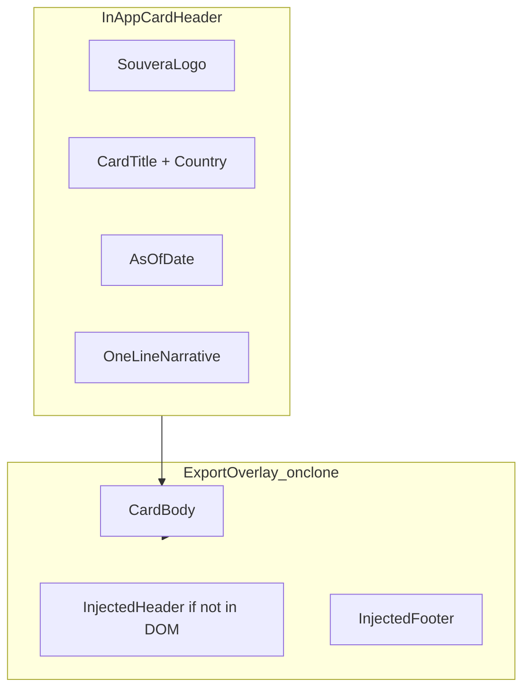

# Intelligence Card Export Standard

**Date:** May 20, 2026  
**Status:** Partially implemented — export chrome live; shared in-app header component backlog  
**Scope:** All exportable intelligence cards across the 7-tab country terminal

---

## Purpose

Define a consistent **in-app card chrome** and **export-only overlay** so PNG exports from Overview, Sectors, Opportunity, Risk, Trade, and Economy tabs share Souvera branding, data freshness, and source attribution.

Today, tab cards use ad-hoc headers; `export-png.ts` injects minimal text at capture time. This spec unifies both layers before rolling PNG export to every card.

---

## Two-Layer Model



---

## Layer 1 — In-App Card Header (visible in UI + captured in PNG)

| Zone | Content | Source |
|------|---------|--------|
| Left | Souvera wordmark (text or SVG) | Static asset `/public/souvera-logo.svg` |
| Center | Card title + country name | `data.country.name` + card-specific label |
| Right | Data-as-of date | `data.freshness.updatedAt` |
| Subline | One-sentence executive narrative | Card teaser or first sentence from API narrative |

### Proposed component

```tsx
<IntelligenceCardHeader
  title="Sector Comparison"
  countryName={data.country.name}
  updatedAt={data.freshness?.updatedAt}
  teaser="Strength, growth, and attractiveness scores across key sectors."
/>
```

### Visual tokens

- Background: `bg-zinc-900/50`
- Border: `border-zinc-800`
- Title: `text-white font-bold`
- Meta: `text-zinc-500 text-xs`
- Teaser: `text-zinc-400 text-sm`

---

## Layer 2 — Export chrome (implemented in `export-png.ts` / `render-pdf.ts`)

**Policy:** No diagonal watermark on subscriber exports. Attribution via header + footer + Terms.

| Zone | Content |
|------|---------|
| Header left | `SOUVERA` wordmark + card title |
| Header right | Country flag + country name + date |
| Footer left | `souveraterminal.com` |
| Footer right | `intelligence@souveraterminal.com` |
| Footer sub | © Souvera Intelligence Terminal · Source attribution |

See `docs/knowledge-base/intelligence-export-and-tier-governance.md` for full branding and tier decisions.

### Extended `exportCardToPNG` options (future)

```typescript
exportCardToPNG({
  elementId: 'sector-comparison-card',
  fileName: 'nga-sector-comparison',
  countryName: 'Nigeria',
  cardTitle: 'Sector Comparison',
  sources: ['World Bank', 'UN Comtrade', 'Souvera Analysis'],
});
```

When `cardTitle` is provided and no in-app header exists in the DOM, `onclone` injects a full header block matching Layer 1 layout.

---

## Cards to adopt (priority order)

1. **Sector Comparison** — `SectorsTab` (`#sector-comparison-card`) ✅ PNG wired
2. **Per-sector accordion** — `SectorsTab` (`#sector-{key}-card`) ✅ PNG wired
3. **Opportunity pillars** — `OpportunityTab`
4. **Risk categories** — `RiskTab`
5. **Trade U.S. relationship card** — `TradeTab`
6. **Overview Executive Snapshot** — `OverviewTabV2`
7. **Economy forecast panel** — `EconomyTab` (Business+ gated)

---

## Implementation backlog

- [ ] Extract `<IntelligenceCardHeader />` shared component
- [ ] Add Souvera logo SVG to `/public`
- [x] Extend `export-png.ts` with `cardTitle`, flag, country context
- [x] Strip `data-export-exclude` elements from export clone
- [x] Remove watermark; use header/footer attribution only
- [ ] Extract `<IntelligenceCardHeader />` shared component
- [ ] Apply chrome to all cards listed above
- [ ] Add export button placement rule: top-right of card header row, visible when `canExport` entitlement present

---

## Entitlement gate for export

| Entitlement | Export access |
|-------------|---------------|
| `full_macro` | PNG export on Professional+ cards |
| `admin_access` | All exports |

Business-tier cards (AGOA, Trade, Reports) use separate entitlements for **content visibility**; PNG export remains tied to `full_macro` unless card is Business-only (future: `reports_preview` for report previews).
