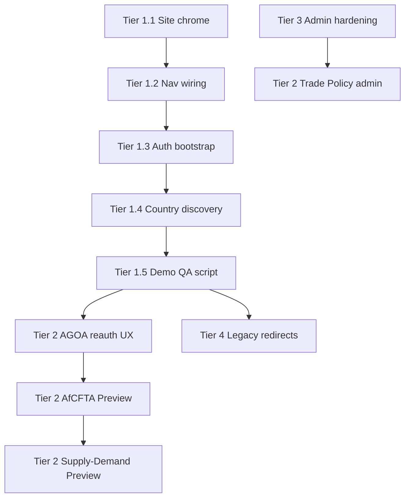

# Navigation Integration Plan — Tiers 1–5

**Date:** 2026-05-31  
**Status:** Approved for review  
**Purpose:** Detailed implementation plan for integrating built-but-orphan pages into the Souvera platform ahead of official launch.  
**Demo priority:** **Tier 1 is launch-blocking** — must complete before stakeholder demos.

**Related:**
- [QA Findings Sprint Plan](./qa-findings-sprint-plan.md)
- [Trade Policy Intelligence Demo Plan](./trade-policy-intelligence-demo-plan.md)
- [Admin Platform Assessment](./admin-platform-assessment-plan.md)
- Canonical nav source: `apps/api-gateway/src/lib/site-navigation.ts`

---

## Tier Overview

| Tier | Scope | Demo | Launch nav |
|------|-------|------|------------|
| **Tier 1** | Functional high-value public intelligence | **Required** | Yes |
| **Tier 2** | Trade policy differentiators (stubs → MVP) | **Required (AGOA)** | Partial (Preview badges) |
| **Tier 3** | Admin operations | Internal only | No |
| **Tier 4** | Legacy route 301 redirects | Nice-to-have | N/A |
| **Tier 5** | Archive / dev-only | No | No |

---

## Tier 1 — Integrate Now (Demo-Critical)

**Goal:** Every demo flow reaches Trade Intelligence and Country Terminal from main navigation without dead ends.

### Routes

| Route | Current state | Target state |
|-------|---------------|--------------|
| `/intelligence/trade` | Built hub, no nav/footer | Full platform chrome + mega nav entry |
| `/intelligence/trade/agoa` | Functional (54 countries, timeline), orphan | Nav + footer + auth bootstrap + cross-links |
| `/country/[iso3]` | Full terminal, not in nav | Deep links from Map, Compare, Trade, Africa/Caribbean hubs |

### Implementation Plan — Tier 1

#### Phase 1.1: Site chrome (1–2 days)

**Files:**
- `apps/api-gateway/src/app/intelligence/trade/page.tsx`
- `apps/api-gateway/src/app/intelligence/trade/agoa/page.tsx`
- New shared layout optional: `apps/api-gateway/src/app/intelligence/trade/layout.tsx`

**Tasks:**
1. Add `SouveraMegaNav` + `SouveraFooter` + `pt-20` offset (match `/intelligence/compare` pattern).
2. Extract shared `TradeIntelligenceShell` if duplication exceeds 2 pages.

**Acceptance:**
- [ ] Trade hub and AGOA tracker visually match Intelligence section pages
- [ ] Back link from AGOA still works; breadcrumb: Intelligence → Trade → AGOA

#### Phase 1.2: Navigation wiring (0.5 day)

**File:** `apps/api-gateway/src/lib/site-navigation.ts`

**Add to Intelligence → Analysis Tools:**
```text
Trade Intelligence    → /intelligence/trade
AGOA Legislative Tracker → /intelligence/trade/agoa
```

**Also update:**
- `apps/api-gateway/src/app/intelligence/IntelligenceHub.tsx` — third tool card
- `apps/api-gateway/src/app/intelligence/africa/page.tsx` — CTA to AGOA tracker
- `apps/api-gateway/src/app/sitemap.ts` — add trade routes
- `apps/api-gateway/src/app/sitemap/page.tsx` — derive from `site-navigation.ts` or sync manually

**Acceptance:**
- [ ] Trade Intelligence reachable from mega nav without direct URL
- [ ] Footer Intelligence group includes Trade link
- [ ] SEO sitemap includes `/intelligence/trade` and `/intelligence/trade/agoa`

#### Phase 1.3: Auth + entitlements on AGOA (1 day)

**Problem:** Business plan users see "Limited View" — session may not resolve on client-only fetch.

**Tasks:**
1. Convert `agoa/page.tsx` to async server component; resolve `resolveUserAccess()` server-side.
2. Pass `initialEntitlement: { planId, planRank, isFullAccess }` to `AGOATrackerClient`.
3. Client fetch uses `credentials: 'include'`; hydrate from SSR props first.
4. Align tier copy: **Business+** for full card detail (apparel badge public at all tiers).
5. Fix outbound links: entitlement-aware (`/access/request-access?country=X` vs `/country/X?tab=trade`).

**Files:**
- `apps/api-gateway/src/app/intelligence/trade/agoa/page.tsx`
- `apps/api-gateway/src/app/intelligence/trade/agoa/AGOATrackerClient.tsx`
- `apps/api-gateway/src/app/api/v1/trade/agoa/route.ts`

**Acceptance:**
- [ ] Logged-in Business user sees KEN apparel note + full card
- [ ] Unauthenticated user sees status badges + timeline + upgrade CTA on details
- [ ] No "Limited View" banner for Business+ users

#### Phase 1.4: Country terminal discovery (0.5 day)

**Tasks:**
1. Intelligence Map — country click → `/country/{iso3}?tab=overview` (verify existing)
2. Compare tool — country name links → country terminal (entitlement-aware)
3. Trade tab AGOA strip — already links to `/intelligence/trade/agoa?country={iso3}`; verify after nav live
4. Sector pages — "View {Country} Intelligence" CTA where sector has key markets

**Acceptance:**
- [ ] Demo script: Home → Intelligence → Trade → AGOA → KEN card → Country Trade tab (no dead ends)

#### Phase 1.5: Demo QA script (0.5 day)

Document 10-minute demo path in `docs/execution/demo-trade-intelligence-script.md` (create at implementation):

1. Intelligence Overview → Trade Intelligence hub
2. AGOA tracker — filter suspended → NGA restoration watchpoint
3. Filter eligible → KEN apparel note
4. Legislative timeline — 2026 reauthorization cliff
5. Deep link to `/country/NGA?tab=trade` — AGOA restoration narrative
6. Compare tool teaser → request access funnel

**Tier 1 exit criteria:** All acceptance boxes checked; demo script walkthrough passes on staging.

---

## Tier 2 — Trade Policy Differentiators (Demo + Launch)

**Strategic context:** AGOA reauthorization through December 31, 2026 creates immediate demand for evidence-based trade policy intelligence. Tier 2 transforms Souvera from "country terminal" to "trade policy platform."

**Full implementation:** See [Trade Policy Intelligence Demo Plan](./trade-policy-intelligence-demo-plan.md).

### Routes

| Route | Current | Tier 2 target |
|-------|---------|---------------|
| `/intelligence/trade/agoa` | Curated 54-country + timeline | **Demo-ready** — enhanced reauth narrative, country deep-links, admin update path |
| `/intelligence/trade/afcfta` | Stub ("Data Curation in Progress") | **Preview MVP** — ratification status for 12 rollout countries |
| `/intelligence/trade/supply-demand` | Stub | **Preview shell** — sector demand signals for 7 sectors × pilot countries |

### Tier 2 Integration Rules (Navigation)

- **AGOA:** Full nav entry (Tier 1)
- **AfCFTA / Supply-Demand:** Listed on Trade hub only with **"Preview"** badge until data-backed; **not** in mega nav until MVP exit criteria met
- Trade hub module cards show status: `Live` | `Preview` | `Planned`

### Tier 2 Phases (Summary)

| Phase | Focus | Timeline estimate |
|-------|-------|-------------------|
| T2-A | AGOA reauthorization UX (watchpoints, alerts, NGA/ETH/KEN highlights) | 3–5 days |
| T2-B | AfCFTA Preview MVP (12 countries, ratification/deposit/trading status) | 5–7 days |
| T2-C | Supply-Demand Preview (pilot sector signals, link from country Sectors tab) | 5–7 days |
| T2-D | Admin: Trade Policy editor (see Admin plan) | 3–5 days |

**Tier 2 exit criteria:**
- [ ] AGOA demo narrative covers reauth cliff, NGA restoration, KEN apparel
- [ ] AfCFTA preview shows real data for ≥12 countries with source attribution
- [ ] Trade hub clearly distinguishes Live vs Preview modules

---

## Tier 3 — Admin (Internal Operations)

**Goal:** Ensure editorial and data ops can sustain Trade Policy Intelligence and country terminal without code deploys.

**Not in public navigation.** Access via `/admin/*` with proper role gating.

**Full assessment:** [Admin Platform Assessment Plan](./admin-platform-assessment-plan.md)

### Summary matrix

| Admin route | Status | Demo/launch need |
|-------------|--------|------------------|
| `/admin/data/news-pulse` | **Functional** | Required — headline review for 12 countries |
| `/admin/content/news` | **Functional** | Required — Souvera News editorial |
| `/admin/data/sources` | Functional | Operational |
| `/admin/data/upload` | Functional | CSV pipeline |
| `/admin/data/ingestion` | **UI stub** | Wire to batch API or hide until live |
| `/admin/data/quality` | **UI stub** | Phase 2 |
| `/admin/data/indicators` | Partial | Operational |
| `/admin/data/crosswalks` | Partial | Operational |
| **Missing:** `/admin/content/trade-policy` | Not built | **Required for Tier 2** — AGOA event + status editor |

### Tier 3 Pre-Launch Requirements

1. Harden admin auth — replace "any authenticated user" with `platform_admin` / `org_admin` only
2. Add Trade Policy admin module for legislative events + country AGOA status
3. Unify duplicate `verifyAdminAccess` implementations across admin API routes
4. Admin runbook for demo prep (seed, news pulse publish, AGOA review)

---

## Tier 4 — Legacy Redirects (301)

**Goal:** Eliminate SEO confusion and broken bookmarks.

**Implementation:** Next.js `redirect()` in `next.config.ts` or route-level redirects.

| Source | Target | Priority |
|--------|--------|----------|
| `/methodology` | `/insights/methodology` | High |
| `/faqs` | `/resources/faq` | High |
| `/source-registry` | `/resources/source-registry` | Medium |
| `/signal-engine` | `/platform/signal-engine` | Medium |
| `/intelligence-map` | `/intelligence/map` | High |
| `/Data-Sources-&-Methodology` | `/resources/data-sources` | Low |
| `/terminal/map` | `/intelligence/map` | Medium |
| `/terminal/caribbean` | `/intelligence/caribbean` | Medium |

**Tasks:**
1. Add redirects to `apps/api-gateway/next.config.ts`
2. Add `scripts/test-legacy-redirects.ts` — assert 301 targets
3. Update internal links grep — no remaining orphan hrefs

**Acceptance:**
- [ ] All legacy URLs return 301 to canonical path
- [ ] No duplicate content in sitemap for legacy paths

---

## Tier 5 — Archive / Dev-Only

**Not in public navigation.** Internal QA and engineering reference only.

| Route | Action |
|-------|--------|
| `/intelligence/caribbean/list-archive` | Keep; link from map-preview only |
| `/intelligence/caribbean/map-preview` | Internal QA; promote when map v2 ready |
| `/intelligence/caribbean/list-archive` | Document as v1 archive |

**Tier 6 (deferred — marketing stubs):** `/solutions`, `/africa-command-center`, `/caribbean-command-center`, etc. — either 301 to `/access` or noindex until content ready. Not in scope for demo.

---

## Implementation Sequence (All Tiers)



**Recommended sprint allocation:**
- **Week 1 (demo):** Tier 1 complete + Tier 3 auth hardening + Sprint H-A quick fixes
- **Week 2:** Tier 2-A (AGOA reauth) + Tier 2-D (admin editor)
- **Week 3:** Tier 2-B/C previews + Tier 4 redirects + Sprint H-B trade depth

---

## Fortune 5 Navigation Principle

Every public nav link must resolve to substantive intelligence or a clear upgrade CTA. Preview modules stay on parent hub with badges until data-backed. Trade Policy Intelligence is the primary differentiator for the AGOA reauthorization window — Tier 1 + Tier 2-A are non-negotiable for demo.

---

## Changelog

| Date | Change |
|------|--------|
| 2026-05-31 | Initial Tier 1–5 implementation plan |
