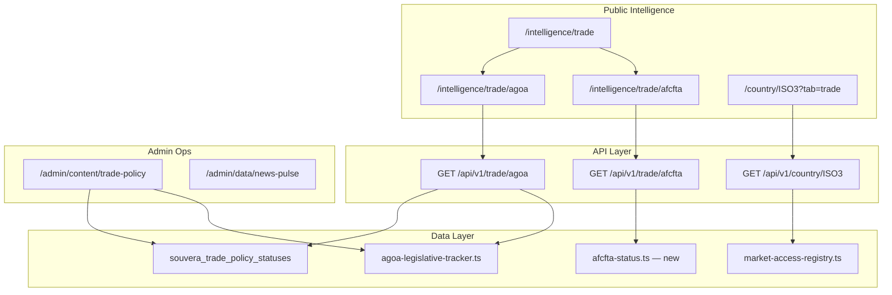

# Trade Policy Intelligence — Implementation Plan (Demo & Launch)

**Date:** 2026-05-31  
**Status:** Approved for review  
**Classification:** Product + Engineering — Demo-critical differentiator  
**Strategic window:** AGOA reauthorization through **December 31, 2026**; USTR modernization consultation; Nigeria restoration watchpoint

**Related strategy docs:**
- [AGOA + AfCFTA Trade Intelligence Assessment](../strategy/agoa-afcfta-trade-intelligence-assessment.md)
- [AGOA/AfCFTA Module PRD](../product/agoa-afcfta-module-prd.md)
- [AGOA/AfCFTA Data Source Inventory](../research/agoa-afcfta-data-source-inventory.md)
- [Navigation Integration Tiers 1–5](./navigation-integration-tiers-1-5.md)
- [Admin Platform Assessment](./admin-platform-assessment-plan.md)

---

## Why This Matters (Fortune 5 Positioning)

No single platform today combines:
- Country governance + sector intelligence (Souvera terminal)
- AGOA eligibility + legislative timeline (USTR lists are static)
- AfCFTA implementation status (AfCFTA Secretariat data is institutional, not investor-facing)
- Product-level trade flows (Comtrade is raw, not contextualized)

**Souvera's wedge during AGOA reauthorization:** Be the evidence platform where U.S.–Africa trade stakeholders answer:
1. Which countries are eligible, suspended, or at watchpoint?
2. What legislative milestones affect my supply chain in 2026–2027?
3. How does AGOA interact with AfCFTA and regional blocs (ECOWAS, EAC, SADC)?
4. What sectors and products benefit from preferential access?

---

## Current Build State

| Component | Location | Status |
|-----------|----------|--------|
| Trade hub | `/intelligence/trade` | Built — no nav/footer |
| AGOA tracker UI | `/intelligence/trade/agoa` | **Functional** — 54 countries, timeline, filters |
| AGOA API | `/api/v1/trade/agoa` | Public teaser + Business+ full detail |
| Curated data | `data/agoa-legislative-tracker.ts` | 6 legislative events + pilot overrides |
| Full coverage | `data/agoa-full-coverage.ts` | 54-country status builder |
| DB table | `souvera_trade_policy_statuses` | Optional; API falls back to curated |
| AfCFTA tracker | `/intelligence/trade/afcfta` | **Stub only** |
| Supply-demand | `/intelligence/trade/supply-demand` | **Stub only** |
| Country Trade tab | `TradeTab.tsx` | AGOA block + link to tracker (Business+ gated) |
| Admin trade editor | — | **Not built** |

---

## Architecture Target



---

## Module 1: AGOA Legislative Tracker (Demo MVP — Tier 1 + 2-A)

### Demo narrative (10 minutes)

1. **Reauthorization cliff** — Timeline event `reauth-deadline-2027`: preferences lapse after 2026 without congressional action
2. **Nigeria restoration** — Suspended since 2015; watchpoint event `nga-restoration-review`
3. **Kenya apparel** — Eligible + third-country fabric rule event `apparel-third-country-2026`
4. **Country terminal link** — NGA Trade tab AGOA restoration copy; KEN eligible utilization

### Implementation phases

#### TPI-1: Platform integration (Tier 1 — P0)

| Task | File(s) | Done when |
|------|---------|-----------|
| Nav + footer | `trade/page.tsx`, `agoa/page.tsx` | Matches compare page |
| Mega nav entry | `site-navigation.ts` | Trade + AGOA linked |
| SSR auth bootstrap | `agoa/page.tsx`, `AGOATrackerClient.tsx` | Business+ sees full cards |
| Public apparel badge | `AGOATrackerClient.tsx`, API mapper | KEN shows "Apparel: Yes" at all tiers |
| Entitlement-aware outbound links | `AGOATrackerClient.tsx` | No dead-end for unauthenticated |
| IntelligenceHub card | `IntelligenceHub.tsx` | Third tool visible |
| Africa hub CTA | `intelligence/africa/page.tsx` | Links to AGOA tracker |

#### TPI-2: Reauthorization UX enhancements (Tier 2-A — P0 for demo polish)

| Feature | Description | Priority |
|---------|-------------|----------|
| **Reauth countdown banner** | "AGOA expires Dec 31, 2026 — X days remaining" on trade hub + AGOA page | P0 |
| **Watchpoint filter** | Filter countries/events by `watchpoint` status (NGA, ETH) | P0 |
| **Affected countries on events** | Click event → highlight affected country cards | P1 |
| **Country highlight from URL** | `?country=KEN` scrolls + rings card (partial exists) | P0 verify |
| **Export timeline PNG** | Legislative timeline card export (follow Sprint D standard) | P2 |
| **Email alert placeholder** | "Notify me on reauthorization" → leads capture | P2 |

#### TPI-3: Data completeness (Tier 2-A)

| Task | Detail |
|------|--------|
| Verify 54-country coverage | `buildCuratedAgoaStatuses()` — all SS Africa ISO3 |
| DB seed optional | Seed `souvera_trade_policy_statuses` for production persistence |
| Source attribution | Every card shows USTR link + `agoa_as_of_date` |
| Suspended countries | NGA, ETH, GMB, etc. — verify status badges |
| Apparel flag | KEN, GHA, LSO, MDG — verify in curated data |

**Data files:**
- `apps/api-gateway/src/data/agoa-legislative-tracker.ts` — events + overrides
- `apps/api-gateway/src/data/agoa-full-coverage.ts` — 54-country builder
- New: `scripts/seed-agoa-trade-policy-statuses.ts`

#### TPI-4: Entitlement policy (align with platform)

| Surface | Public | Explorer | Business+ |
|---------|--------|----------|-----------|
| Country status badge | Yes | Yes | Yes |
| Apparel eligible flag | Yes | Yes | Yes |
| Legislative timeline (all events) | Yes | Yes | Yes |
| Eligible since / suspension date | No | No | Yes |
| Notes + source citations | No | No | Yes |
| Country terminal Trade tab | No | Teaser | Full |

**Decision:** Timeline stays public (thought leadership / SEO); card detail at Business+.

#### TPI-5: Country terminal integration

| Task | File |
|------|------|
| Trade tab AGOA strip links to tracker with `?country=` | `TradeTab.tsx` |
| Market access registry feeds AGOA status on Overview | `market-access-registry.ts` |
| NGA $0 sector exports show suspension context | `SectorsTab.tsx` |
| Import breakdown complements export story | `TradeTab.tsx` + trade data files |

**Acceptance (AGOA demo MVP):**
- [ ] Demo script in Tier 1 plan completes without errors
- [ ] Business user sees KEN apparel note on AGOA page
- [ ] Timeline shows ≥6 events including 2026 reauth + NGA watchpoint
- [ ] Reauth countdown visible on trade hub
- [ ] NGA → Trade tab → AGOA tracker → back navigation works

---

## Module 2: AfCFTA Status Tracker (Preview MVP — Tier 2-B)

### Scope for demo (not full 54-country at launch)

**Phase 1 — 12 rollout countries:** NGA, JAM, KEN, GHA, ZAF, ETH, SEN, CIV, TZA, TTO, BRB, BHS (Africa subset only for AfCFTA)

### Data model (new)

```typescript
// apps/api-gateway/src/types/afcfta-status.ts
interface AfCftaCountryStatus {
  country_iso3: string;
  signed: boolean;
  ratified: boolean;
  deposited_instrument: boolean;
  trading_status: 'not_started' | 'pilot' | 'operational';
  tariff_phase: string | null;
  notes?: string;
  source_url: string;
  as_of_date: string;
}
```

### Implementation

| Task | Estimate |
|------|----------|
| Create `afcfta-status.ts` curated data (12 countries) | 1 day |
| API `GET /api/v1/trade/afcfta` | 1 day |
| Client page (replace stub) — country grid + status badges | 2 days |
| Nav: Preview badge on trade hub only | 0.5 day |
| Link from African country Overview market access card | 0.5 day |

**Sources:** AfCFTA Secretariat, tralac, AU trade documents.

**Acceptance:**
- [ ] 12 countries show ratification/trading status with source links
- [ ] Page labeled "Preview" — not in mega nav until 54-country coverage

---

## Module 3: Supply-Demand Matrix (Preview Shell — Tier 2-C)

### Demo scope

7 sectors × 3 pilot countries (NGA, KEN, JAM) — supply capacity vs demand signal (high/medium/low).

### Implementation (minimal viable preview)

| Task | Estimate |
|------|----------|
| Static matrix data file | 1 day |
| Preview page with sector × country heatmap | 2 days |
| Link from Sectors tab "View supply-demand context" | 0.5 day |

**Defer:** Full 74-market matrix, Comtrade automation, HS code drill-down.

---

## Module 4: Market Access Registry (Cross-cutting — Sprint H-B)

Unifies AGOA, AfCFTA, ECOWAS, EAC, SADC, COMESA, CARICOM, CBI across:
- Country Overview main card
- Sidebar `MarketAccessSummary`
- Trade tab regional agreements
- Opportunity regional tiles

**File:** `apps/api-gateway/src/lib/intelligence/market-access-registry.ts`

**Blocks:** Caribbean sidebar bleed fix; ZAF showing ECOWAS incorrectly.

---

## Module 5: Import/Export Trade Depth (Sprint H-B + Tier 2)

| Phase | Deliverable |
|-------|-------------|
| H-B Phase 1 | `importComposition[]` + UI for 12 countries |
| Tier 2 extension | Top 10 HS chapters (export + import) for NGA/KEN/JAM |
| Backlog | Comtrade automated ingestion |

---

## Admin Operations for Trade Policy (Tier 3)

**Required before launch editorial cadence:**

| Capability | Route | Purpose |
|------------|-------|---------|
| Edit legislative events | `/admin/content/trade-policy/events` | Add/update reauth milestones without deploy |
| Edit country AGOA status | `/admin/content/trade-policy/agoa` | USTR review updates |
| Publish workflow | draft → review → publish | Audit log |
| AfCFTA status editor | `/admin/content/trade-policy/afcfta` | Phase 2 |

See [Admin Platform Assessment](./admin-platform-assessment-plan.md) for full spec.

---

## Demo vs Launch Checklist

### Demo-ready (minimum)

- [ ] Tier 1 navigation complete
- [ ] AGOA tracker with nav/footer + auth
- [ ] Reauth countdown banner
- [ ] NGA + KEN demo narrative paths work
- [ ] Business user entitlement verified
- [ ] Admin can publish news pulse headlines for demo countries

### Launch-ready (full Tier 2)

- [ ] AfCFTA preview (12 countries)
- [ ] Trade Policy admin editor
- [ ] Import breakdown on all 12 countries
- [ ] Market access registry live
- [ ] DB-backed AGOA status with curated fallback
- [ ] Extended purity tests for all rollout countries

---

## Risk Register

| Risk | Mitigation |
|------|------------|
| AGOA status stale vs USTR | Admin editor + `agoa_as_of_date` on every card |
| Auth not resolving on trade pages | SSR bootstrap (Tier 1.3) |
| AfCFTA scope creep | Cap preview at 12 countries; Preview badge |
| Legal disclaimer | "Curated intelligence — verify with official sources" on all trade pages |
| Entitlement confusion | Single tier matrix doc; align Business+ everywhere |

---

## Estimated Effort

| Module | Demo | Launch |
|--------|------|--------|
| TPI-1 Platform integration | 3 days | 3 days |
| TPI-2 Reauth UX | 2 days | 3 days |
| TPI-3 Data completeness | 1 day | 2 days |
| AfCFTA Preview | — | 5 days |
| Supply-Demand Preview | — | 4 days |
| Market access registry | — | 3 days |
| Import breakdown | — | 3 days |
| Trade Policy admin | 2 days (minimal) | 5 days |
| **Total** | **~8 days** | **~28 days** |

---

## Changelog

| Date | Change |
|------|--------|
| 2026-05-31 | Initial trade policy intelligence implementation plan |
