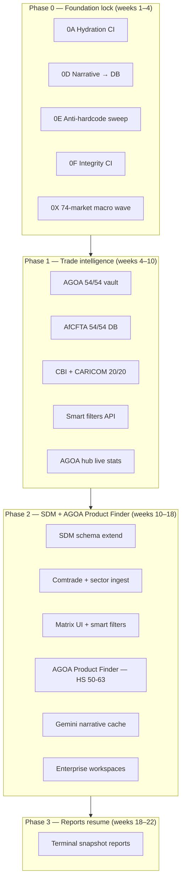

# Supply-Demand Matrix & Trade Intelligence — Implementation Plan

**Status:** Approved for planning (stakeholder decisions recorded)  
**Date:** 2026-06-10  
**Owner:** Platform / Trade Intelligence  
**Aligns with:** [foundation-assessment-2026.md](./foundation-assessment-2026.md)  
**Source research:** `docs/trade intelligence/` (TRD + brainstorming notes)

---

## Executive summary

Souvera's trade intelligence module should become the **authoritative 74-market decision-support layer** — combining vault-backed policy status (AGOA, AfCFTA, CBI, CARICOM), observation-backed macro/trade data, and a **Supply-Demand Matrix (SDM)** with three "smart filter" modes from the research:

1. **AGOA Export Potential** — Africa surplus + AGOA eligible → US export opportunity  
2. **US Reciprocal Opportunity** — Africa/Caribbean deficit + US supply capacity → reauthorization argument  
3. **AfCFTA Matchmaker** — Intra-African surplus ↔ deficit pairing by sector  

Gemini 2.5 Flash powers **on-demand executive narratives** (cached, never sent the full matrix). The matrix itself is **100% observation-backed** — AI explains verified data; it does not invent numbers.

**Accelerated path:** Finish Phase 0 for 12 rollout markets in parallel with a **74-market data wave** (macro + policy), then ship AGOA-first trade intelligence (Phase 1), then SDM + **AGOA Product Finder** (Phase 2), then resume reports (Phase 3).

**Confirmed decisions (2026-06-10, updated 2026-06-10):**

| Decision | Choice | Rationale |
|----------|--------|-----------|
| Matrix dimensions | **74 × 8 sectors** (592 cells) | Manufacturing & Textiles is now an SDM sector |
| Manufacturing & Textiles | **SDM sector #1** + **Product Finder Tier 1** | SDM = macro WHERE; Product Finder = product-level WHAT |
| Module order (Trade Hub) | **SDM → Product Finder → AGOA Tracker → AfCFTA** | SDM anchors context; Product Finder drives reauthorization ROI |
| Product Finder structure | **3 tiers**: Priority ~150 (sector-organized) → Full catalog (~6,400 reference) | Depth before breadth; never show empty rows as intelligence |
| SDM data gate (74 markets) | **≥15/20 Top 20 keys** before Phase 2 scoring | Confirmed |
| Enterprise workspaces | **Phase 2E** — after core matrix + Product Finder | Confirmed |
| Gemini key | Centralized `GEMINI_API_KEY` | Done |

---

## Strategic alignment (what we adopt vs. adapt from TRD)

| TRD proposal | Souvera decision | Rationale |
|--------------|------------------|-----------|
| New `countries`, `treaty_participations` tables | **Reject** — use `souvera_countries`, `souvera_country_policy_status`, Evidence Vault | SDC single authority |
| Python + Celery workers | **Adapt** — keep `services/ingestion` (TS) + optional Python scripts for one-off BACI/FAOSTAT | Existing ops model |
| 9 sectors (incl. manufacturing/textiles) | **7 matrix sectors** + **AGOA Product Finder** (essential co-module) | Apparel is AGOA's highest-ROI vertical — cannot be buried in generic drill-down |
| Corporate workspaces / monitored vectors | **Phase 2D** (Enterprise tier) | Confirmed deferral |
| Post-AGOA scenario toggle | **Phase 2D** — `isPostAgoaMode` on workspace + tariff shock calc | Bundled with Enterprise workspaces |
| Gemini in Python | **TypeScript** — `@google/generative-ai` in api-gateway server actions | Matches Next.js stack |

---

## Accelerated roadmap (revised sequencing)



### Phase 0 — finish + accelerate (parallel tracks)

| Track | Work | Exit |
|-------|------|------|
| **A — Rollout quality** | 0D narrative migration, 0E static module removal, 0F CI gates | 12/12 markets SDC-clean |
| **B — 74-market macro** | Extend `check-rollout-top20` → `check-all74-top20`; batch WB + IMF + Comtrade gap-fill | ≥15/20 keys for all 74 (≥18/20 for 12 rollout) |
| **C — Policy baseline** | Overlap with Phase 1: vault verify all 54 AGOA + 20 Caribbean | Zero seed-default eligibility in APIs |

**Key acceleration tactic:** Do not wait for perfect 20/20 on all 74 before starting Phase 1 AGOA. Policy vault + eligibility UI has **no macro dependency**. SDM scoring requires macro/trade keys — gate Phase 2 on ≥15/20 for 74 markets.

### Phase 1 — AGOA-first trade intelligence

Priority order (ROI):

1. **AGOA Tracker** — already live UI; complete vault-backed 54/54 + legislative timeline  
2. **AGOA Product Finder — foundation** — seed HS reference (chapters 50–63 first), apparel eligibility per country, USTR product-list ingestion scaffold  
3. **Smart Filter API** — three modes as query params on new endpoint  
4. **AfCFTA Tracker** — vault + tralac ingestion (Preview → Live)  
5. **Caribbean CBI/CARICOM** — parity with Africa  
6. **Trade hub live stats** — eligible count, days-to-expiry, apparel-eligible count, filter result counts  

### Phase 2 — Supply-Demand Matrix + AGOA Product Finder

Deliver in **five sub-phases** (Product Finder is essential, not optional):

| Sub-phase | Deliverable | Scope |
|-----------|-------------|-------|
| **2A — Scored matrix MVP** | Country × sector scores in DB + heatmap UI | 74 × 7 = 518 |
| **2B — Smart filters + AI** | Filter modes + Gemini cached narratives | 518 cells + narratives |
| **2C — AGOA Product Finder** ⭐ | HS-level search, apparel focus, tariff compare, country opportunity | 54 Africa × HS 50–63 (MVP); expand to full AGOA list |
| **2D — Gemini + cross-links** | Product Finder ↔ SDM ↔ AGOA tracker integration | End-to-end trade intelligence loop |
| **2E — Enterprise workspace** | Saved portfolios, tariff shock, post-AGOA mode | Enterprise tier |

### Phase 3 — Reports as terminal snapshots

Unchanged from foundation assessment. SDM and AGOA state must be SDC-compliant before re-enable.

---

## SDM — seven matrix sectors (canonical)

Aligned with live stub at `apps/api-gateway/src/app/intelligence/trade/supply-demand/page.tsx` (8 sectors locked 2026-06-10 - Manufacturing & Textiles added as #8 to anchor AGOA Product Finder):

| # | `sector_key` | Label | Primary HS / BPM6 mapping |
|---|--------------|-------|---------------------------|
| 1 | `digital-infrastructure` | Digital Infrastructure | ISIC J + ITU broadband |
| 2 | `fintech` | Fintech & Digital Finance | BPM6 SG + WB Findex |
| 3 | `energy` | Energy & Renewables | HS 27 |
| 4 | `agriculture` | Agriculture & Agribusiness | HS 01–24 + FAOSTAT |
| 5 | `critical-minerals` | Mining & Critical Minerals | HS 25–26, 71–83 |
| 6 | `logistics` | Logistics & Trade | BPM6 SF + WB LPI |
| 7 | `tourism-hospitality` | Tourism & Hospitality | BPM6 SD |
| **8** | **`manufacturing`** | **Manufacturing & Textiles** | **HS 50-63 + ISIC C** |

## 3-tier trade intelligence structure (locked)

```
Tier 1 — Supply-Demand Matrix (74 × 8)
  Answers: WHERE?  Which country × sector has the strongest signal?
  Sectors: Manufacturing & Textiles · Agriculture · Energy · Mining & Minerals
           · Technology · Logistics · Tourism · Fintech
  Cell: supply_score / demand_score / opportunity_score / strategic_priority

Tier 2 — AGOA Product Finder (~150 priority products)
  Answers: WHAT?  Which specific products prove the two-way AGOA street?
  Smart filters: AGOA export potential · US reciprocal opportunity · Apparel provisions
  US state mapping: reciprocal briefings per congressional district
  Phases: catalog seeded now → flows from Comtrade → Gemini narratives

Tier 3 — Full Product Catalog (~6,400)
  Answers: IS IT ELIGIBLE?  Reference layer for compliance research
  View: search by HS code / description / chapter; eligibility badge
  When to use: confirming eligibility for a known product, not primary analysis
```

---

## AGOA Product Finder — essential module (Phase 1 scaffold → Phase 2C ship)

**Route:** `/intelligence/trade/agoa/products`  
**Why essential:** AGOA's special apparel provisions (HS 50–63) and ~6,400 eligible products are the primary lever for investors, EPZ operators, and USTR modernization evidence. No competitor combines 54-country eligibility + HS-level flows + supply-demand context in one terminal.

### MVP scope (Phase 2C — ship with SDM)

| Layer | Coverage | Data authority |
|-------|----------|----------------|
| **Apparel & textiles** | HS chapters 50–63 (priority) | UN Comtrade + USTR AGOA product list |
| **AGOA eligibility** | Per country + per product category | Evidence Vault (`agoa_status`, `agoa_apparel_eligible`) |
| **US demand signal** | US imports by HS-6 from Africa | Census / Comtrade (partner=USA) |
| **African supply signal** | Exports by HS-6 to US + world | Comtrade |
| **Tariff treatment** | AGOA preference (0%) vs MFN | USTR / ITC MacMap reference (admin-published) |
| **Rules of origin** | Summary + link to USTR guidance | Published content (T2), not hard-coded |

### UI layout

```
┌─────────────────────────────────────────────────────────────────────────┐
│ AGOA Product Finder                    [Search HS / product name]        │
│ Filters: Country · Chapter (50-63) · Eligible only · Surplus/Deficit   │
├─────────────────────────────────────────────────────────────────────────┤
│ ⚡ Souvera Trade Analysis (Gemini) — Kenya · HS 6109 · Apparel           │
├─────────────────────────────────────────────────────────────────────────┤
│ Product table: HS-6 · Description · Africa export · US import ·        │
│   Net position · AGOA eligible · Apparel provision · MFN rate · Trend    │
├─────────────────────────────────────────────────────────────────────────┤
│ [View in Supply-Demand Matrix]  [View country AGOA status]  [Export CSV] │
└─────────────────────────────────────────────────────────────────────────┘
```

### Data model (new tables)

```sql
-- Reference: HS codes with AGOA eligibility flags
CREATE TABLE public.souvera_agoa_product_catalog (
  hs_code CHAR(6) PRIMARY KEY,
  chapter INTEGER NOT NULL,           -- 50-63 for apparel MVP
  description TEXT NOT NULL,
  is_agoa_specific BOOLEAN DEFAULT FALSE,
  is_apparel_provision BOOLEAN DEFAULT FALSE,
  mfn_rate_pct NUMERIC(5,2),
  rules_of_origin_summary TEXT,
  source_id UUID REFERENCES public.souvera_data_sources(id),
  as_of_date DATE NOT NULL
);

-- Country × HS trade flows (observation-backed)
CREATE TABLE public.souvera_country_product_trade (
  id UUID PRIMARY KEY DEFAULT gen_random_uuid(),
  country_id UUID NOT NULL REFERENCES public.souvera_countries(id),
  hs_code CHAR(6) NOT NULL REFERENCES public.souvera_agoa_product_catalog(hs_code),
  export_to_us_usd NUMERIC(18,2),
  export_world_usd NUMERIC(18,2),
  import_from_us_usd NUMERIC(18,2),
  net_position_usd NUMERIC(18,2),
  us_import_demand_usd NUMERIC(18,2),  -- US total imports of this HS (global)
  opportunity_score INTEGER CHECK (opportunity_score BETWEEN 0 AND 100),
  source_id UUID REFERENCES public.souvera_data_sources(id),
  period_year INTEGER NOT NULL,
  UNIQUE (country_id, hs_code, period_year)
);
```

### Phase 1 scaffold (start during AGOA vault work)

- Load HS chapters 50–63 reference (~200 subheadings) into `souvera_agoa_product_catalog`  
- Ingest Comtrade flows for **12 rollout African markets** × HS 50–63 (pilot)  
- Add `agoa_apparel_eligible` badge wiring on AGOA tracker country rows  
- Trade hub card: **"AGOA Product Finder — Apparel & Textiles"** with Preview → Live badge progression  

### Cross-links (mandatory)

| From | To |
|------|-----|
| AGOA Tracker country row | Product Finder pre-filtered to that country |
| SDM matrix cell (any sector) | Product Finder when sector maps to HS chapter |
| Product Finder result row | Country terminal Trade tab |
| Smart filter "AGOA Export Potential" | Product Finder sorted by `opportunity_score` desc |

### Smart filter integration

Product Finder rows feed **Filter 1 (AGOA Export Potential)** at HS granularity:

```
AGOA Export Potential (product level) =
  agoa_eligible = true
  AND net_position_usd > 0
  AND (export_to_us_usd / export_world_usd) < 0.5   -- under-penetrated US market
```

---

## Data model (extend existing — do not fork)

### Existing: `souvera_sector_supply_demand` (sql-pack v1.14)

Already has `supply_score`, `demand_score`, `opportunity_score`. **Extend** with trade-flow fields:

```sql
-- sql-pack-v1.15-sdm-trade-flows.sql (proposed)
ALTER TABLE public.souvera_sector_supply_demand
  ADD COLUMN IF NOT EXISTS domestic_supply_usd NUMERIC(18,2),
  ADD COLUMN IF NOT EXISTS apparent_demand_usd NUMERIC(18,2),
  ADD COLUMN IF NOT EXISTS net_position_usd NUMERIC(18,2),
  ADD COLUMN IF NOT EXISTS us_export_capacity_usd NUMERIC(18,2),
  ADD COLUMN IF NOT EXISTS friction_score INTEGER CHECK (friction_score BETWEEN 0 AND 100),
  ADD COLUMN IF NOT EXISTS strategic_priority TEXT CHECK (strategic_priority IN (
    'agoa_export', 'us_reciprocal', 'afcfta_match', 'cbi_export', 'neutral'
  ));
```

### New: `souvera_trade_ai_cache`

```sql
CREATE TABLE public.souvera_trade_ai_cache (
  cache_key TEXT PRIMARY KEY,          -- md5(country_iso3 + sector_key + filter_mode + YYYY-MM)
  country_iso3 CHAR(3) NOT NULL,
  sector_key TEXT NOT NULL,
  filter_mode TEXT NOT NULL,             -- agoa_export | us_reciprocal | afcfta_match | cell_detail
  narrative_text TEXT NOT NULL,
  model_id TEXT NOT NULL DEFAULT 'gemini-2.5-flash',
  source_snapshot JSONB,                 -- scores + policy status at generation time
  generated_at TIMESTAMPTZ NOT NULL DEFAULT NOW(),
  expires_at TIMESTAMPTZ NOT NULL
);
```

### New: `souvera_us_state_sector_map` (reference)

Static reference data (allowed in TS as **routing keys**, not facts):

| sector_key | us_states[] | source_label |
|------------|-------------|--------------|
| agriculture | CA, IA, IL, NE | US ITA / Census |
| energy | TX, LA, PA | US ITA / Census |
| critical-minerals | NV, AK, NY | US ITA / Census |

### Scoring engine (deterministic — no AI)

Per country `c`, sector `s`:

```
apparent_demand = domestic_production + imports - exports
net_position    = exports - imports
supply_score    = normalize(domestic_production, regional_percentile)
demand_score    = normalize(apparent_demand, regional_percentile)
opportunity     = f(supply_score, demand_score, agoa_eligible, friction_score)
strategic_priority = smart_filter_classifier(net_position, region, agoa_status)
```

**Data sources (ingestion order):**

1. UN Comtrade (existing connector) — imports/exports by HS group  
2. World Bank / IMF observations — macro context, LPI proxy  
3. FAOSTAT — agriculture production (Africa + Caribbean)  
4. Evidence Vault — `agoa_status`, `afcfta_trading_status`  
5. BACI mirror (batch CSV, annual) — reconcile asymmetric reporting  

---

## API surface

| Endpoint | Method | Purpose |
|----------|--------|---------|
| `/api/v1/trade/supply-demand` | GET | Matrix payload: filters, pagination, entitlement gate |
| `/api/v1/trade/supply-demand/[iso3]/[sector]` | GET | Cell detail + sector summary |
| `/api/v1/trade/supply-demand/filters` | GET | Smart filter results (3 modes) |
| `/api/v1/trade/supply-demand/narrative` | POST | Gemini narrative (cache-first) |
| `/api/v1/trade/agoa/products` | GET | **AGOA Product Finder** — HS search, country filter, chapter 50–63 |
| `/api/v1/trade/agoa/products/[hs6]` | GET | Product detail: flows, tariff, eligibility, top countries |
| `/api/v1/trade/agoa` | GET | Exists — extend with apparel badge + Product Finder links |
| `/api/v1/trade/afcfta` | GET | Exists — vault-backed path |

**Query params for matrix:**

```
?region=africa|caribbean|all
&sector=agriculture,energy,...
&filter=agoa_export|us_reciprocal|afcfta_match
&agoa_eligible=true
&min_opportunity=60
```

---

## UI/UX specification

### Page: `/intelligence/trade/supply-demand`

**Layout zones (top → bottom):**

1. **Runway banner** — "AGOA expires Dec 31, 2026 · N days remaining" (shared with trade hub)  
2. **Filter bar** — Region · Country · Sector · Smart Filter mode · AGOA eligible toggle  
3. **Executive metrics row** — 3 `SouveraMetricBlock`-style stats: cells matched, total surplus USD, total deficit USD  
4. **AI narrative card** — `SouveraTradeAnalysisCard` (Gemini, cache badge)  
5. **Matrix heatmap** — 74 rows × 7 columns; cell color = opportunity_score; click → slide-over detail  
6. **Detail drawer** — sector summary, policy badges, **"Open in AGOA Product Finder"** CTA, source links  

### Page: `/intelligence/trade/agoa/products` (AGOA Product Finder — essential)

**Layout zones:**

1. **Runway banner** — shared AGOA cliff countdown + apparel provision callout  
2. **Search + filters** — Country · HS chapter (default 50–63) · Eligible only · Net position · Sort by opportunity  
3. **AI narrative card** — Gemini briefing per selected HS-6 or country+chapter  
4. **Product table** — HS-6 rows with export/import/net, AGOA badge, MFN rate, 3yr trend sparkline  
5. **Action bar** — View in SDM · View AGOA status · Export CSV (Professional+)  

**Visual language:**

| Element | Treatment |
|---------|-----------|
| Surplus cells | Emerald scale (supply-led) |
| Deficit cells | Blue scale (demand / US reciprocal) |
| Policy-blocked | Amber hatch overlay |
| Unverified / sparse data | Zinc + "Curated preview" badge |
| Post-AGOA mode (2D) | Amber border system-wide |

**Entitlements:**

| Plan | Access |
|------|--------|
| Free / Explorer | Matrix preview: 3 pilot countries (NGA, KEN, JAM), 2 sectors |
| Professional | Full 74 × 7, smart filters, cached AI narratives |
| Enterprise | Workspaces, post-AGOA scenario, CSV export, lobbying PDF |

### Page: `/intelligence/trade/agoa` (enhancements)

- Add **"AGOA Product Finder"** primary CTA (apparel & textiles) in header  
- Add **"View in Supply-Demand Matrix"** link per country row  
- Show `agoa_apparel_eligible` badge per country (vault-backed)  
- Add smart filter chips: "Export potential" / "US reciprocal" pre-filtered views  
- Legislative cliff countdown (already partially present)  

### Cross-links

- **AGOA Tracker → Product Finder** (country pre-filter, chapter 50–63 default)  
- **Product Finder → SDM** (sector context for selected product's HS chapter)  
- Country Trade tab → SDM cell + Product Finder for apparel  
- Sector hub pages → "Supply-demand context" widget (top 3 countries)  
- AfCFTA tracker → AfCFTA Matchmaker filter pre-applied  

---

## Gemini integration (TypeScript)

**Location:** `apps/api-gateway/src/lib/ai/gemini-client.ts`  
**Env:** `GEMINI_API_KEY`, `GEMINI_MODEL` (default `gemini-2.5-flash`) via `packages/config/src/env.ts`

**Rules:**

1. **Never** pass full matrix — only single-cell or filter-summary payload (&lt;2 KB JSON)  
2. **Always** inject: region-appropriate act (AGOA vs CBI/CBTPA), Dec 2026 urgency, structured scores from DB  
3. **Cache-first** — check `souvera_trade_ai_cache` before API call  
4. **Conservative** — if scores missing, return institutional fallback copy (no AI hallucination)  
5. **Server-only** — API routes / server actions; key never in client bundle  

**Prompt personas (from research):**

- `agoa_active` — urgent, preference optimization, 6-month runway  
- `post_agoa` — defensive, tariff shock, AfCFTA routing  
- `us_reciprocal` — deficit-as-opportunity for US exporters + state mapping  

---

## Ingestion pipeline

```
Comtrade / FAOSTAT / WB
        ↓
services/ingestion/sdm-sector-fill.ts
        ↓
souvera_sector_supply_demand (upsert)
        ↓
sdm-scoring-job (nightly)
        ↓
smart_filter_materialized_view (optional)
```

**Nightly schedule:** 01:00 UTC (aligns with TRD); invalidate AI cache keys where `source_snapshot` scores changed &gt;5%.

---

## Testing & CI gates

| Test | Command / location |
|------|-------------------|
| 74-market macro coverage | `npm run check:all74-top20` (new) |
| SDM cell count | `npm run test:sdm-coverage` — expect 518 rows |
| AGOA Product Finder coverage | `npm run test:agoa-product-finder` — HS 50–63 × 54 countries |
| No static scores in TS | ESLint + grep `src/data/*trade*` |
| Smart filter logic | `scripts/test-sdm-smart-filters.ts` |
| Gemini cache miss/hit | `scripts/test-gemini-trade-narrative.ts` (mocked) |
| Policy consistency | Extend `test-phase-0b-policy-consistency.ts` to 74 |

---

## Success metrics

| Metric | Phase 1 target | Phase 2 target |
|--------|----------------|----------------|
| Vault-backed AGOA (UI) | 54/54 | 54/54 |
| 74-market Top 20 coverage | ≥15/20 all | ≥18/20 all |
| SDM cells populated | 0 | 518/518 |
| AGOA Product Finder (HS 50–63) | 0 pilot (12 markets) | 54 countries × ~200 HS codes |
| Smart filter response time | — | &lt;200ms (cached scores) |
| AI narrative latency | — | &lt;2s (cache miss), &lt;50ms (hit) |
| Static trade TS modules | 0 | 0 |

---

## Implementation phases — file map

| Phase | New / modified files |
|-------|---------------------|
| 0X | `scripts/check-all74-top20-coverage.ts`, ingestion gap-fill jobs |
| 1 | `lib/trade/smart-filters.ts`, `souvera_agoa_product_catalog` seed (HS 50–63), extend `trade/agoa` API |
| 2A | SQL pack v1.15, `api/v1/trade/supply-demand/route.ts` |
| 2B | `lib/ai/gemini-client.ts`, `SouveraTradeAnalysisCard.tsx`, `SupplyDemandMatrix.tsx` |
| 2C | `api/v1/trade/agoa/products`, `AGOProductFinderClient.tsx`, `souvera_country_product_trade` |
| 2E | `souvera_saved_workspaces` (Enterprise) |

---

## Remaining open decisions

1. **Caribbean SDM:** same 7 sectors for all 74, or exclude mining for Caribbean-only views?  
2. **Gemini scope:** trade narratives only vs. shared key for news drafts + report assist?  
3. **Product Finder Phase 2C expansion:** stop at HS 50–63 or include full ~6,400 AGOA product list in same release?  

---

## Revision log

| Date | Change |
|------|--------|
| 2026-06-10 | Initial plan; Gemini env centralized |
| 2026-06-10 | Q&A: 7-column matrix; Product Finder elevated to essential |
| 2026-06-10 | **Final structure locked**: 74×8 SDM (Manufacturing & Textiles as sector #1); 3-tier Product Finder; module order SDM → Finder → Trackers |
| 2026-06-11 | **Phase 0X closed** — 68/74 markets ≥15/20 Top 20; SOM filled via IMF DataMapper; DMA/GRD/KNA at 20/20 via ECCU curated fill; 6 structural ceilings (ERI, SSD, CUB, PRI, VGB, TCA) marked with `LimitedCoverageBanner`; foundation now ready for Phase 0D/0E/0F then Phase 1 |
